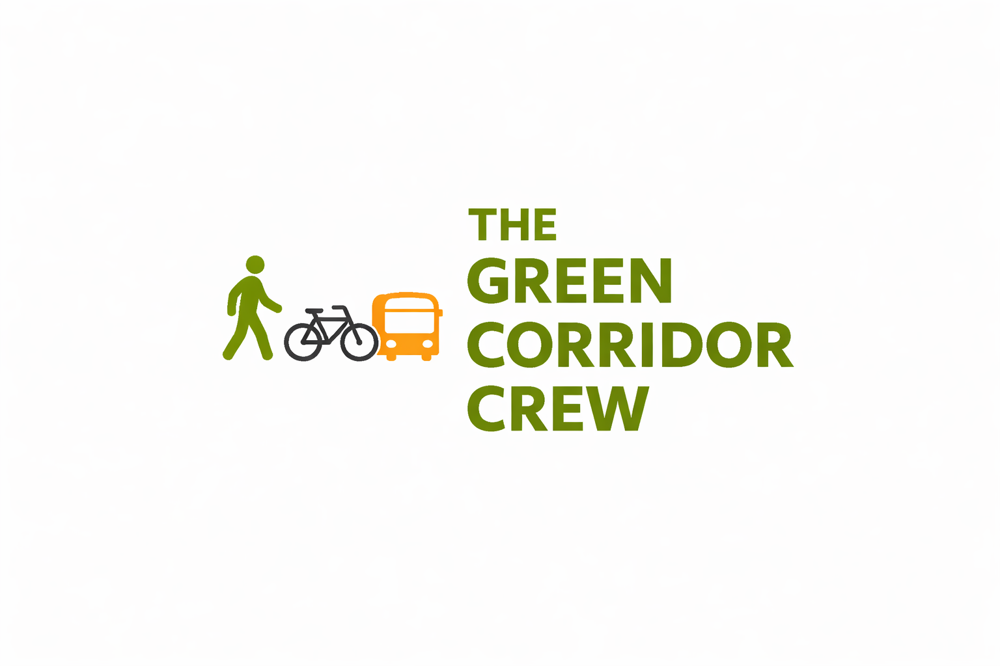
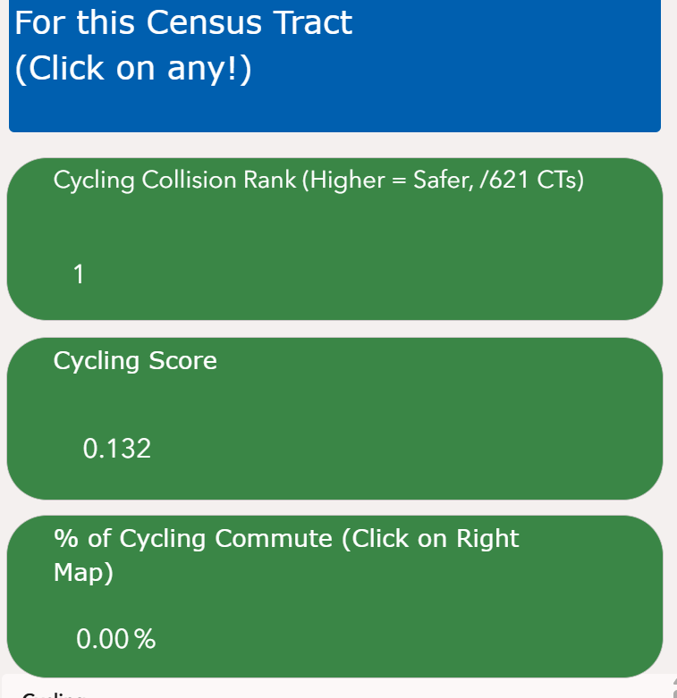
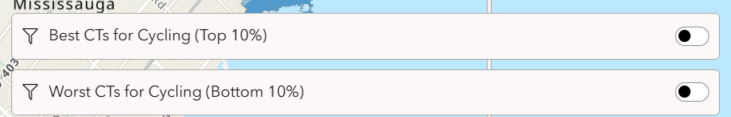
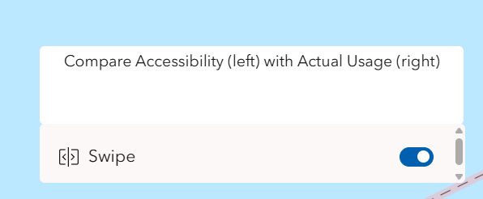
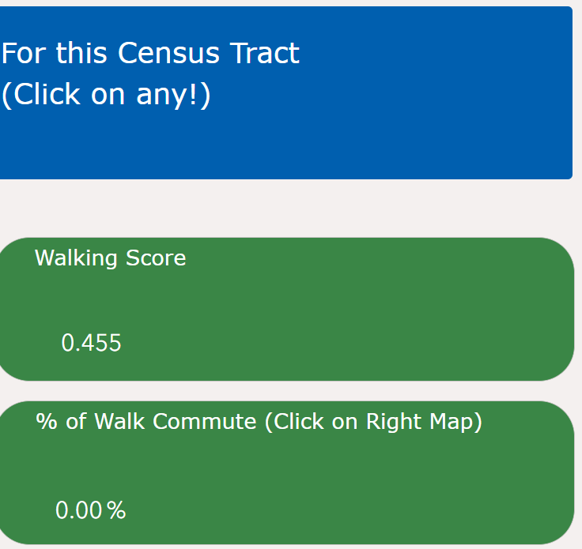
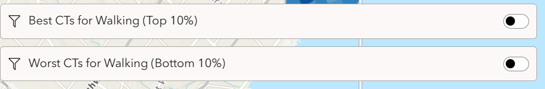
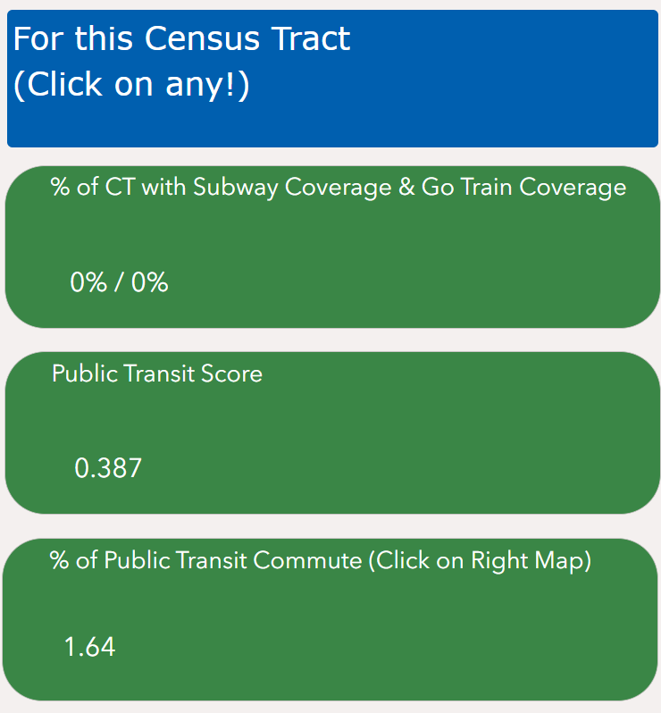
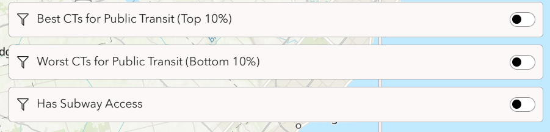
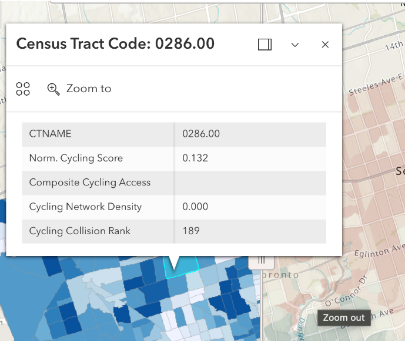

# Green Corridor Crew: Empowering Smarter, Greener Mobility Choices in Toronto

## TEAM
* DUNCAN WAN
* DONIQUE WHYLLY
* QIYU WANG

## Mission Statement
Urban transportation systems play a critical role in shaping how individuals access opportunities, services, and daily necessities, yet access to safe, efficient, and sustainable mobility remains unevenly distributed across cities. In Toronto, rapid urban growth, rising congestion, and increasing environmental pressures have intensified the need for transportation solutions that are not only efficient but also equitable and sustainable. Despite ongoing investments in public transit and active transportation infrastructure, significant disparities persist at the neighborhood level in terms of accessibility, safety, and infrastructure quality. These disparities can limit individuals’ ability to make informed, sustainable transportation choices and reinforce broader patterns of spatial inequality.

MoveGreen TO aims to address these challenges by providing a comprehensive, data-driven platform that evaluates and compares walking, cycling, and transit options across census tracts. The application measures transportation performance through three core dimensions: accessibility, safety, and infrastructure, to generate clear, standardized scores for each mode of travel. By translating complex spatial data into intuitive insights, the app empowers users to identify the most suitable and sustainable transportation options within their neighborhoods.

Beyond individual decision-making, MoveGreen TO serves as a tool for advancing more equitable and sustainable urban mobility. It highlights gaps in infrastructure and service provision, supports evidence-based planning, and encourages shifts toward lower-emission modes of transportation. In doing so, the app contributes to a broader vision of a city where all residents have the ability to move safely, efficiently, and sustainably, regardless of where they live.

## App Characteristic
The MoveGreen TO app is designed to provide an interactive way for users to explore sustainable transportation methods across neighborhoods in Toronto and decide which method is most accessible, safe, and practical in their neighborhood.  

A key feature of the app is its ability for users to seamlessly switch between the different transportation modes, select their census tract, and view an overall score for that specific mode of transportation in their census tract on a 0 to 1 scale, with 1 being the best in terms of safety, accessibility, and infrastructure availability. On the combined map, users can compare these scores across each mode of transportation. They can also see the density of transportation infrastructure available, the composite accessibility score, and how their census tract ranks in safety for that mode of transportation (cycling and walking only) compared to other census tracts. 

Users can compare transportation scores and real-world usage patterns using a swipe tool, allowing them to visually examine differences between the indices and scores, and the percentage of residents using each mode of transportation within a census tract. This enables them to identify spatial mismatches between infrastructure and behavior, such as areas with high accessibility but low usage, or vice versa. These features enable users to identify areas that perform well or poorly under different sustainable transportation methods. The app is structured around both mode selection and score comparisons (e.g., top- and bottom-performing neighborhoods). This makes it easier for users to quickly assess whether an area is relatively well-served or underserved in terms of accessibility.

## Methodology
Practicality of a transportation method is based on the presence of infrastructure, such as sidewalks for walking and cycling networks for biking. The modes of public transit considered include Subways, Light Rail Transit (LRT), Bus Rapid Transit (BRT), GO Train, and Priority bus corridors, combined in an overall composite index to represent the presence of transit infrastructure in each census tract. The assumption is that if the majority of the census tract (over 50%) can access their nearest transit stop within 10 to 15 minutes, which is approximately an 800-meter distance, that choice of transportation is considered practical. Safety for cycling and walking is measured according to the frequency of death-inducing or serious injuries causing car collisions with cyclists and pedestrians, respectively, in each census tract. Further, accessibility is measured according to Statistics Canada’s Spatial Access measures that quantify the ease of reaching destinations of varying levels of attractiveness from an origin. The composite accessibility indices for each census tract represent the ease with which residents can access health care facilities, employment, sports and recreation facilities, education facilities (primary, secondary, and post-secondary), cultural and arts facilities, child care, and grocery stores (within one, three, or five minutes). The scores from these ten measures were combined to create one equally weighted accessibility measure. Together, the overall walking, cycling, and transit score that each user sees for their census tract is a weighted average of standardized safety, infrastructure, and accessibility measures. Importantly, standardization allows for the measures to be comparable by preventing any single variable from disproportionately influencing the index due to differences in scale.

## Calculating Composites
**Public Transit: **
### Infrastructure Composite:
- RTF Stops: 30%
- RTF Network: 40%
- TTC: 20%
- GO: 10%
### Overall Infrastructure (Weighted Index)
- Infrastructure: 65% 
- Accessibility (Proxy of demand and viability): 35% 
- Given the measurement uncertainties and data constraints, a safety index was not calculated for public transit. 
### Biking (Weighted Index)
- Cycling network  (bike route density in the census tract): 40%
- Total number of cycling collisions in the census tract (safety): 30%
- Accessibility (proxy for demand and viability): 30%
### Walking (Weighted Index)
- Pedestrian network (pedestrian network density in the census tract): 40%
- Total number of pedestrian collisions in the census tract (safety): 30%
- Accessibility (proxy for demand and viability): 30%

## User Guide

Green Corridor Crew is an interactive mapping application that helps users explore sustainable transportation accessibility across census tracts in Toronto. The app compares **cycling**, **walking**, and **public transit** and helps users understand which transportation mode is most practical, safe, and accessible in different neighborhoods.

Users can either **search for an address** or **click directly on the map** to select a census tract and view transportation scores.

---

### Overview

The MoveGreen TO  app is an interactive mapping tool designed to help users explore sustainable transportation methods across census tracts in Toronto. The app allows users to compare the sustainable modes of transportation, such as cycling, walking, and public transit, and to decide which mode is most practical, safe, and accessible for their neighborhood. Users can either search for an address or click directly on the map to select a census tract and view its transportation scores.

---

### Main Pages

The app contains **four main pages**:

#### 1. All Page
The **All** page gives users an overall view of transportation methods. After selecting a census tract, the left panel displays the **Cycling Score, Walking Score, and Public Transit Score** allowing users to identify which transportation mode performs best in that tract.

After selecting a census tract, the left panel displays:

- Cycling Score
- Walking Score
- Public Transit Score

This page also includes three filter toggles:

- Best Mode: Cycling
- Best Mode: Walking
- Best Mode: Public Transit

These filters highlight census tracts where one transportation mode has the strongest score among the three, according to levels of accessibility, safety, and the presence of infrastructure that allows for that mode of transportation. This helps users quickly identify which areas are best served by cycling, walking, or public transit.

---

#### 2. Cycling Page

The **Cycling** page focuses on cycling accessibility.

After selecting a census tract, users can view:

- Cycling Score
- Cycling Collision Rank (where available)
- % of Cycling Commute
- legend information for the cycling layer

This page also includes filter buttons for:

- Best CTs for Cycling (Top 10%)
- Worst CTs for Cycling (Bottom 10%)

These filters help users identify the highest- and lowest-performing census tracts for cycling accessibility.

It also contains a **swipe comparison tool**:

- **Left side:** cycling accessibility
- **Right side:** actual cycling commute usage

Users can drag the vertical swipe bar to compare accessibility and actual cycling behavior.

---

#### 3. Walking Page

The **Walking** page focuses on walking accessibility.

After selecting a census tract, users can view:

- Walking Score
- % of Walk Commute
- legend information for the walking layer

This page also includes filter buttons for:

- Best CTs for Walking (Top 10%)
- Worst CTs for Walking (Bottom 10%)

It also contains a **swipe comparison tool**:

- **Left side:** walking accessibility
- **Right side:** actual walking commute usage

Users can drag the swipe bar to compare accessibility and actual walking behavior.

---

#### 4. Public Transit Page

The **Public Transit** page focuses on transit accessibility.

After selecting a census tract, users can view:

- Public Transit Score
- % of CT with Subway Coverage and GO Train Coverage
- % of Public Transit Commute
- legend information for the transit layer

This page also includes filter buttons for:

- Best CTs for Public Transit (Top 10%)
- Worst CTs for Public Transit (Bottom 10%)
- Has Subway Access

The **Has Subway Access** filter helps identify census tracts with subway coverage.

The Has Subway Access filter allows users to identify census tracts with subway access coverage. Based on your notes, public transit scoring includes bus routes, subway lines, and GO train access, and subway and GO stations are represented using 800-metre buffer zones to capture service areas. The transit index is built from a transit coverage component plus an accessibility component, with the transit coverage component weighted across GO Train, Bus, and Subway.

This page also contains a **swipe comparison tool**:

- **Left side:** public transit accessibility
- **Right side:** actual public transit commute usage

Users can drag the swipe bar to compare accessibility and actual public transit behavior.

---

### How to Use the App

#### Step 1: Choose a page

Use the navigation tabs at the top of the app to switch between:

- All
- Cycling
- Walking
- Public Transit

The **All** page is best for a general overview, while the other three pages provide more detailed mode-specific information.

#### Step 2: Find a census tract
There are *two ways* to locate a census tract:

#### Option A: Search by address
Type an address into the search bar. The map will zoom to that location so the corresponding census tract can be identified.

#### Option B: Click directly on the map
Click on any census tract directly on the map. The information panel on the left will update automatically.

### How to Interpret the App
The app is intended to help users answer questions such as:
Which transportation mode is strongest in a given census tract?
Does high accessibility correspond to high real-world usage?
Are there census tracts where infrastructure and behavior do not match?
Which areas appear well served, and which appear underserved?
### Tips for Users
Start on the All page if you want a broad overview.
Use the search bar if you want to examine a specific address.
Use the map click function if you want to compare different parts of Toronto quickly.
Use the swipe tool on the three mode-specific pages to better understand the gap between accessibility and real commuting behavior. 

### What the App Helps Users Explore

This app helps answer questions such as:

- Which transportation mode is strongest in a given census tract?
- Does high accessibility correspond to high real-world usage?
- Are there census tracts where infrastructure and commuting behavior do not match?
- Which areas appear well served, and which appear underserved?

---

### Methodological Notes

The transportation scores are based on a weighted combination of:

- **Infrastructure**
- **Safety**
- **Accessibility**

#### Infrastructure
Practicality is measured based on the presence of transportation infrastructure, such as:

- sidewalks for walking
- cycling networks for biking
- transit infrastructure for public transit

Public transit infrastructure includes:

- Subway
- Light Rail Transit (LRT)
- Bus Rapid Transit (BRT)
- GO Train
- Priority bus corridors

A transportation option is considered practical when most of the census tract can access the nearest stop or network within about **10 to 15 minutes**, or roughly **800 metres**.

#### Safety
Safety for cycling and walking is measured using the frequency of severe or fatal collisions involving cyclists and pedestrians in each census tract.

#### Accessibility
Accessibility is measured using spatial access indicators that estimate how easily residents can reach important destinations, including:

- health care facilities
- employment
- sports and recreation
- education
- cultural and arts facilities
- child care
- grocery stores

These measures are combined into a standardized composite accessibility index.

#### Final Scores
The final **Walking**, **Cycling**, and **Public Transit** scores are weighted averages of standardized infrastructure, safety, and accessibility measures. Standardization ensures that no single measure dominates the index due to scale differences.

---

### Features Summary

- address search
- clickable census tracts
- overall comparison page
- three mode-specific pages
- top 10% and bottom 10% filters
- subway access filter on public transit page
- swipe comparison between accessibility and actual usage

---

## Project Goal

The goal of this app is to support smarter and greener mobility choices in Toronto by making sustainable transportation patterns easier to understand and compare at the census tract level.

## Data Sources

### Walking
- Spatial Accessibility Measures (Statistics Canada)
- Sheet “acs_public.csv” was used
- https://www150.statcan.gc.ca/n1/pub/27-26-0001/272600012023001-eng.htm
- Pedestrian Network (Open Data Toronto)
- https://open.toronto.ca/dataset/toronto-centreline-tcl/
- Pedestrian Collisions (Open Data Toronto)
- https://open.toronto.ca/dataset/motor-vehicle-collisions-involving-killed-or-seriously-injured-persons/
- filtered for collisions that involved injuries/deaths of pedestrians

### Cycling
- Spatial Accessibility Measures 2024  Spatial Accessibility Measures (Statistics Canada)
- https://www150.statcan.gc.ca/n1/pub/27-26-0001/272600012023001-eng.htm
- Sheet “acs_cycling_all_ages_and_abilities.csv” was used
- Cycling Network (Open Data Toronto)
- https://open.toronto.ca/dataset/cycling-network/
- Cycling Collisions (Open Data Toronto)
- https://open.toronto.ca/dataset/motor-vehicle-collisions-involving-killed-or-seriously-injured-persons/
- filtered for collisions that involved injuries/deaths of pedestrians

### Subway Sations
- https://www.arcgis.com/home/item.html?id=05200e06ff524319bde9f16e5955496b&sublayer=0#overview

### CT Boundaries/Characteristics
- https://www12.statcan.gc.ca/census-recensement/2021/geo/sip-pis/boundary-limites/index2021-eng.cfm?year=21

### % of Commuters by mode of transport
- https://www12.statcan.gc.ca/census-recensement/2021/dp-pd/prof/index.cfm?Lang=E
- Used Geography Level: Census Tract
- Extracted with the use of R
